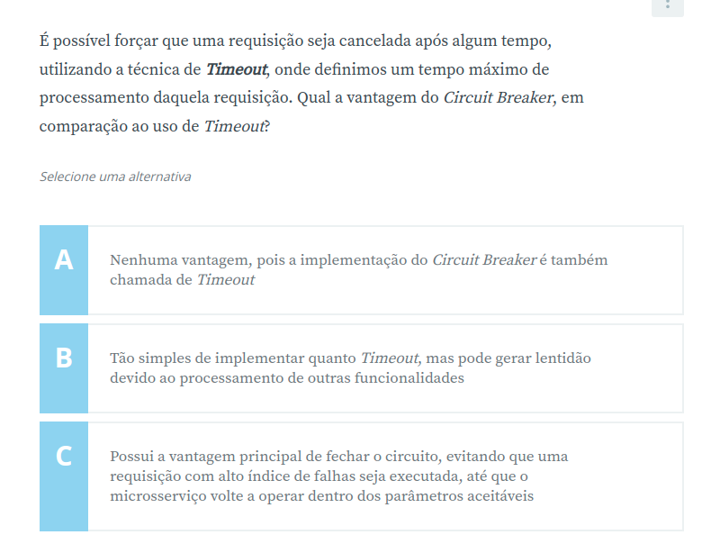

# Microservices com Spring Cloud: Circuit Breaker, Hystrix e API Gateway

Código do Curso de
[Microservices com Spring Cloud: Circuit Breaker, Hystrix e API Gateway](https://www.alura.com.br/curso-online-microservices-spring-cloud-circuit-breaker-api-gateway)

Continuação do curso [Microservices com Spring Cloud: Registry, Config Server e Distributed Tracing](https://github.com/alyleite/microservices-spring-cloud-registry-config-server-distributed-tracing-alura)

### O curso aborda os seguintes itens:

* Utilizando o API Gateway com Spring Zuul
* Implementando a autenticação e autorização com token
* Tratando erros em um sistema distribuído
* Alta disponibilidade com Bulkhead
* Aprendendo Fallback e Circuit Breaker

### Conteúdo detalhado:

1. Fallback e Circuit Breaker
    1. Ambiente e versões
    2. Circuit Breaker e Fallback
    3. Implementando a solução
    4. Timeout e Circuit Breaker
    5. Circuit Breaker vs Fallback Method
2. Bulkhead com Hystrix
    1. O que é Bulkhead?
    2. Processamento paralelo com microsserviços
    3. Bulkhead na prática
3. Lidando com transação e erros
    1. Importação do novo serviço
    2. Integração entre serviços
    3. O que é a compra?
    4. Tratando erros na integração
    5. Orquestrador como cliente
4. API Gateway com Spring Zuul
    1. Introdução ao Zuul
    2. Zuul vs Eureka
    3. Zuul na prática
    4. Integração entre o Zuul e o Eureka Server
5. Autenticação e autorização
    1. Introdução à autenticação
    2. Identificando o usuário logado
    3. Servidor de autenticação
    4. Spring Security e Spring Cloud Oauth
    5. Validando o token
    6. Repassando o token
    7. Feign interceptor

### Tecnologias e ferramentas utilizadas
* Java 11 (Spring boot)
* Eureka
* Spring Config Server
* Spring Feign
* Spring Sleuth
* Spring Zuul
* Spring Security
* Spring Cloud Oauth
* Hystrix
* Papertrail
* Lombok
* MySQL
* Postman

